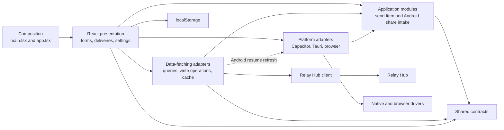

# Web app architecture

The web app uses a layer-first, Clean Architecture-inspired ports-and-adapters design. React owns presentation, TanStack Query owns client-side cached Relay Hub data and request state, application modules own selected workflows, and platform modules isolate browser and native drivers. Dependencies generally point inward, with a few documented frontend-specific concentrations.

This document describes the current architecture under `apps/web-app/src`. Repository-wide architectural rules remain authoritative in [Architecture](architecture.md), and product terminology remains authoritative in [Content Relay](../CONTEXT.md).

## Vocabulary

This document uses the following terms consistently:

- A **module** is anything with an interface and an implementation, from a function to a package.
- An **interface** is everything a caller must know to use a module correctly, including invariants, ordering, errors, configuration, and performance characteristics.
- A **seam** is the location where an interface allows behavior to vary without editing the caller.
- An **adapter** satisfies an interface at a seam and connects it to a driver or another module.
- A module is **deep** when a small interface hides substantial behavior and gives callers leverage and maintainers locality.

## Architectural summary

The source is organized by technical responsibility at the top level and by feature within those layers. It is not an MVC, Redux/Flux, or fully feature-sliced architecture.

```text
apps/web-app/src/
├── app/              React presentation, providers, forms, styling, and composition
├── application/      Application workflows and inward-facing interfaces
├── data-fetching/    Relay Hub queries, write coordination, cache policy, and RPC adapters
├── platform/         Capacitor, Tauri, and browser integrations
├── main.tsx          React entrypoint and global composition
└── settings-storage.ts
                      Settings validation, serialization, and browser persistence
```

There is no app-local domain layer. The web app consumes the shared Device, Item, Delivery, identifiers, and schemas from `@content-relay/contracts`.

## Dependency direction



The dashed data-fetching-to-platform edge is a current cross-outer-layer concentration used to refresh Deliveries on Android resume; it is not a general dependency direction to copy.

The dependency rules are:

- `application/**` may depend on shared contracts and framework-independent validation, but not React, TanStack Query, Capacitor, browser globals, or the Relay Hub client.
- `data-fetching/**` adapts Relay Hub access and TanStack Query behavior into interfaces suitable for presentation modules.
- `platform/**` contains concrete browser and native integrations. A platform adapter may import an application interface that it satisfies.
- `app/**` composes application modules and adapters, renders application values, and owns presentation-specific state.
- Raw external values remain `unknown` until validated at the seam where they enter trusted application behavior.

Placement follows the behavior rather than the operation name: put Relay Hub RPC calls, query keys, and cache mechanics in `data-fetching/**`; put validation, ordering, authorization, and other business policy in `application/**`; and extract cross-surface invariants into a named shared domain package when one exists. `libs/contracts` owns shared contracts and schemas, not application policy by default.

## Layer ownership

| Architectural role  | Source                                                | Responsibility                                                                          |
| ------------------- | ----------------------------------------------------- | --------------------------------------------------------------------------------------- |
| Composition         | `main.tsx`, `app/app.tsx`, `app/global-providers.tsx` | React root, global providers, error handling, and page assembly                         |
| Presentation        | `app/**`                                              | Rendering, forms, interaction state, Suspense and error states, and view formatting     |
| Application         | `application/**`                                      | Item validation and sending policy, plus the Android Share Intent lifecycle             |
| Relay Hub adapters  | `data-fetching/**`                                    | RPC translation, query keys, TanStack Query mutations, caching, refresh, and pagination |
| Platform adapters   | `platform/**`                                         | Capacitor, Tauri, browser lifecycle, share integration, and URL opening                 |
| Shared model        | `@content-relay/contracts`                            | Device, Item, Delivery, identifiers, schemas, and Relay Hub resource shapes             |
| Browser persistence | `settings-storage.ts`                                 | Settings validation, JSON serialization, and `localStorage` access                      |

## Runtime composition

Composition is distributed across a small number of outer modules:

1. [`main.tsx`](../apps/web-app/src/main.tsx) verifies the DOM root and installs global styles, [`GlobalProviders`](../apps/web-app/src/app/global-providers.tsx), and the [`AppErrorBoundary`](../apps/web-app/src/app/components/app-error-boundary.tsx).
2. [`app/app.tsx`](../apps/web-app/src/app/app.tsx) installs the [`SettingsProvider`](../apps/web-app/src/app/components/settings-context.tsx) and assembles the sending, delivery, settings, and toast UI.
3. [`app/use-android-share-intent.ts`](../apps/web-app/src/app/use-android-share-intent.ts) constructs the Android Share Intake with its Capacitor adapter and translates its subscription interface into React state.
4. [`data-fetching/send-item.ts`](../apps/web-app/src/data-fetching/send-item.ts) constructs the Item-sending application module with Relay Hub RPC adapters.

React modules with no props can still have a nontrivial interface. For example, the sending module requires Query, Toast, and Settings providers, while the delivery module requires Query and Settings providers, even though those requirements do not appear in their prop types.

## State ownership

State is divided by lifetime and responsibility instead of collected in one global store.

| State                                         | Owner                      | Persistence and synchronization                                                        |
| --------------------------------------------- | -------------------------- | -------------------------------------------------------------------------------------- |
| Cached Relay Hub data and request status      | TanStack Query             | Query keys include the Relay Hub URL and relevant Device identity                      |
| Saved settings in memory                      | Settings context           | Initialized from storage; writes are delegated to the storage module                   |
| Saved settings persistence                    | `settings-storage.ts`      | Validated, serialized, and stored in `localStorage`                                    |
| Form values and validation                    | TanStack Form              | Local to each form; schemas are shared with the relevant application or storage module |
| Dialog selection and presentation interaction | React presentation modules | Local React state                                                                      |
| Manual Delivery refresh workflow flags        | `useDeliveryHistory`       | Facade-local React state alongside TanStack Query request state                        |
| Android Share Draft and native lifecycle      | Android Share Intake       | Native listener, pending-share consumption, and subscriber publication                 |
| Android-to-React bridge status                | `useAndroidShareIntent`    | React loading and settling state around the intake subscription and actions            |

There is no general-purpose application store or event bus.

## Main runtime flows

### Save settings

1. [`app/components/settings-form.tsx`](../apps/web-app/src/app/components/settings-form.tsx) validates the Relay Hub URL and Device nickname with the settings schema.
2. The [`SettingsProvider`](../apps/web-app/src/app/components/settings-context.tsx) updates React state and calls the storage module.
3. [`settings-storage.ts`](../apps/web-app/src/settings-storage.ts) serializes the parsed settings into `localStorage`.
4. The current-Device query is keyed by Relay Hub URL and Device nickname; the Delivery query is keyed by Relay Hub URL and the resolved Device ID. Data is therefore isolated across each query's relevant identity inputs.

### Establish the current Device

1. Presentation modules create a query with the Relay Hub URL and Device nickname.
2. [`data-fetching/current-device.ts`](../apps/web-app/src/data-fetching/current-device.ts) registers the current Device and lists all Devices.
3. The query removes the current Device from eligible targets and builds a Device-nickname index for Delivery presentation.
4. TanStack Query shares the result between the sending and delivery modules through the stable query key.

### Send an Item

1. [`app/components/send-text-form.tsx`](../apps/web-app/src/app/components/send-text-form.tsx) gathers the Item type, targets, title, and value.
2. [`application/send-item.ts`](../apps/web-app/src/application/send-item.ts) validates and normalizes the input, selects the text or URL operation, and omits an empty title.
3. [`data-fetching/send-item.ts`](../apps/web-app/src/data-fetching/send-item.ts) adapts those operations to the Device-scoped Relay Hub client.
4. If the form came from an Android Share Intent, the application module completes the native share only after the Relay Hub send succeeds.

The final ordering rule belongs to the application module: a failed Relay Hub send must not report the Android share as completed.

### Receive an Android Share Intent

1. [`platform/share-plugin.android.ts`](../apps/web-app/src/platform/share-plugin.android.ts) exposes the Capacitor plugin through the application-defined Android share adapter interface.
2. [`application/android-share-intake.ts`](../apps/web-app/src/application/android-share-intake.ts) subscribes before consuming a pending share, validates native values, maps them into a Share Draft, and ensures a newly received event wins over an older consumed value.
3. The React hook subscribes to the Share Draft and exposes loading, settling, cancellation, and completion state.
4. The sending form uses the Share Draft as its initial Item values and keys the form by the share identifier so a newer share resets the form.

### Read and open Deliveries

1. [`data-fetching/deliveries.ts`](../apps/web-app/src/data-fetching/deliveries.ts) fetches paginated Deliveries for the current Device.
2. The module merges pages by Delivery identifier, orders Deliveries newest-first, refreshes every loaded page, and uses the [Android lifecycle adapter](../apps/web-app/src/platform/app-lifecycle.android.ts) to refresh when the Android App resumes.
3. [`app/components/delivery-list.tsx`](../apps/web-app/src/app/components/delivery-list.tsx) renders the view, presents recoverable query and mark-viewed errors, and opens supported Items.
4. Text Items open in an in-app dialog. URL Items use the [platform URL module](../apps/web-app/src/platform/open-url.ts), with an in-app fallback when external opening fails.
5. Opening a supported Delivery marks it as viewed and refreshes the cached Delivery history.

## Deep modules and seams

### Android Share Intake

`createAndroidShareIntake` is the deepest application module in the web app. Its `subscribe`, `cancel`, and `complete` interface hides native availability, payload validation, URL classification, listener ownership, pending-value consumption, latest-event-wins races, failure semantics, and cleanup.

The seam is real: the Capacitor adapter is used in production and an in-memory adapter exercises the same interface in tests.

### Send Item

`createSendItem` presents one callable interface and hides validation, whitespace normalization, text-versus-URL dispatch, request mapping, optional title handling, and Android completion ordering.

The Relay Hub adapter and test adapters satisfy the same construction seam, allowing application behavior to be verified without React or a Relay Hub.

### Delivery history

`useDeliveryHistory` is a deep frontend facade: it hides infinite-query setup, cache identity, page merging, deduplication, sorting, manual refresh, Android-resume refresh, older-page loading, and the TanStack Query mark-viewed mutation. Its returned interface is broader than the two application modules because presentation must distinguish several independent loading and error states.

### Current Device query

`createCurrentDeviceQuery` hides a multi-request setup workflow and returns values already shaped for callers through a TanStack Query options interface. It does not currently provide an injected seam, so it is verified with an integration test against a real test Relay Hub.

### Small adapters and presentation primitives

The Capacitor and Relay Hub adapters are intentionally shallow: they translate between an inward-facing interface and a concrete driver. Presentation primitives such as `DSButton`, `useAppForm`, and the React context helper provide smaller local interfaces over Base UI, TanStack Form, and React conventions.

## Error and asynchronous rendering model

- The app-wide React error module handles unexpected rendering and Suspense errors and offers retry or reload actions.
- Delivery loading uses Suspense with a query-aware reset module so a failed query can be retried without reloading the app.
- TanStack Query mutations expose their pending and recoverable error states through data-fetching interfaces.
- Successful user actions use the shared toast provider.
- Application failures propagate as rejected promises; presentation decides whether to display, retry, or escalate them to an error module.
- Global query defaults disable automatic retries and refetch-on-focus behavior, keeping user-triggered failure and retry semantics explicit.

## Styling and presentation structure

- Linaria styled elements are co-located with the presentation module that owns them.
- Global CSS is limited to the reset, document defaults, and reusable design tokens.
- Base UI supplies accessible behavior for primitives such as buttons, inputs, and toasts.
- The local design-system and form modules register shared presentation behavior without creating a separate package.
- View formatting remains in presentation code; for example, Delivery timestamps, Item previews, and file summaries are not application rules.

## Testing architecture

Tests cross the same seams as production callers:

- [`test/send-item.test.ts`](../apps/web-app/test/send-item.test.ts) verifies Item validation, mapping, dispatch, and Android completion ordering through in-memory adapters.
- [`test/android-share-intake.test.ts`](../apps/web-app/test/android-share-intake.test.ts) verifies native lifecycle, validation, races, cleanup, and failure semantics through an in-memory Android adapter.
- [`test/current-device.test.ts`](../apps/web-app/test/current-device.test.ts) verifies the TanStack Query interface against a real test Relay Hub.
- [`test-e2e/**`](../apps/web-app/test-e2e) verifies settings, sending, Deliveries, platform-visible behavior, and error handling through the rendered app.

This follows the repository testing order: integration tests for seams and cross-module behavior, end-to-end tests for user-visible wiring, and focused tests for complex application logic.

## Current architecture concentrations

The following are current implementation facts, not patterns to copy automatically:

- `data-fetching/current-device.ts` owns both Relay Hub access and the application-like workflow of registering a Device, listing Devices, selecting eligible targets, and building presentation lookup data.
- `data-fetching/deliveries.ts` combines React state, TanStack Query policy, Relay Hub access, pagination, cache replacement, and Android lifecycle refresh in one facade.
- Presentation modules consume validated shared Relay Hub resource shapes directly instead of mapping them into separate presentation models.
- Settings presentation depends directly on the concrete `localStorage` module; no storage interface is injected.
- Composition is distributed across the React entrypoint, page assembly, the Android hook, and the Relay Hub Item-sender factory rather than centralized in one file.
- [`app/form/use-app-form.ts`](../apps/web-app/src/app/form/use-app-form.ts) and [`app/form/form-components.tsx`](../apps/web-app/src/app/form/form-components.tsx) contain an intentional import cycle created by TanStack Form's context-registration pattern.

These choices keep a small frontend direct. Revisit a seam when behavior gains a second adapter, business policy starts spreading across callers, tests need to reach past the current interface, or framework knowledge begins moving into application modules.

## Guidance for future changes

- Put Relay Hub RPC calls, query keys, TanStack Query mutations, pagination, and cache synchronization in `data-fetching/**` unless the behavior is application policy shared beyond that adapter.
- Put Device, Item, and Delivery validation, ordering, authorization, and other policy in application modules or a named shared domain package, not React or driver code.
- Accept dependencies at an application seam instead of constructing external drivers inside application modules.
- Add a seam when behavior actually varies; one adapter is a hypothetical seam, while two adapters make the variation real.
- Keep Capacitor, Tauri, browser globals, and native payload handling in `platform/**` or another outer adapter.
- Validate external data before passing trusted values inward.
- Keep presentation modules focused on rendering, interaction, forms, and view formatting.
- Put shared cross-package contracts and schemas in `libs/contracts`.
- Test through the module interface that production callers use.
- Prefer deepening an existing module over adding a pass-through layer that only moves complexity into callers.
